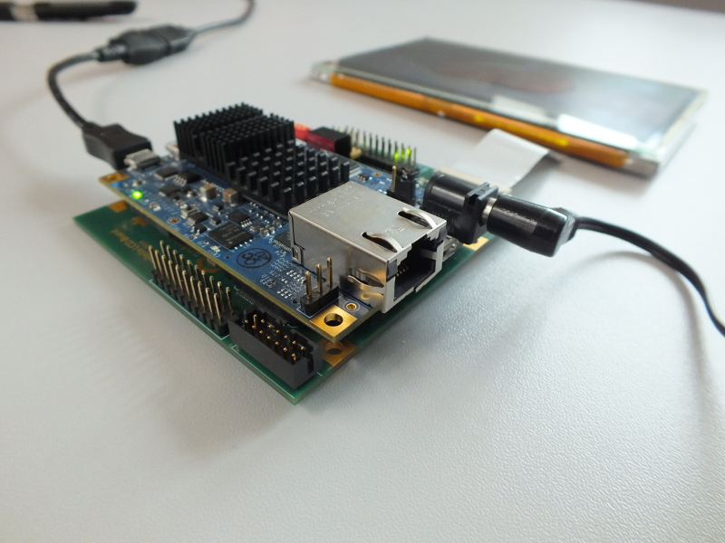

=================================
Antmicro Parallella LCD baseboard
=================================

Copyright (c) 2014-2021 `Antmicro <https://www.antmicro.com>`_

This is a repository containing the hardware design files for an LCD baseboard created by `Antmicro Ltd <http://antmicro.com>`_ for the `Parallella board <http://parallella.org/>`_ from `Adapteva <http://adapteva.com>`_.
The baseboard is released as open hardware.

Repository contents
-------------------

* *altium-project.zip* - Altium Designer project (Altium Designer Release 14)
* *schematics.pdf* - schematics
* *assembly-drawings.pdf* - assembly drawings
* *board-dimensions.pdf* - board dimensions
* *bom.pdf* - Bill of Materials (BOM)
* *gerbers.zip* - Gerber files

If you have any questions contact us at contact@antmicro.com.

Change Log
----------

.. csv-table::
   :header-rows: 1
   
   Title,Date,Version
   Initial release,2014-10-29,0.1.0
   
