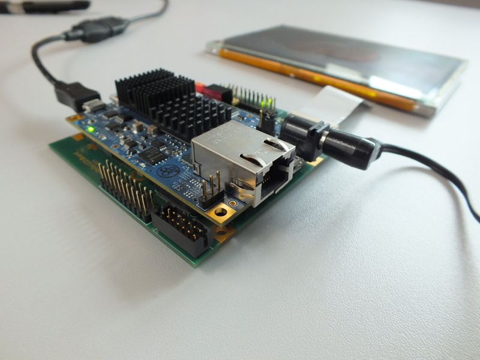

=================================
Antmicro Parallella LCD baseboard
=================================

Copyright (c) 2014-2021 `Antmicro <https://www.antmicro.com>`_

Overview
--------

This is a repository containing the hardware design files for an LCD baseboard created by `Antmicro Ltd <http://antmicro.com>`_ for the `Parallella board <http://parallella.org/>`_ from `Adapteva <http://adapteva.com>`_.
The baseboard is released as open hardware.

Repository contents
-------------------

* ``pcb`` - PCB design files prepared in Altium Designer
* ``doc`` - PCB documentation including schematics, mechanical drawings and Gerber files
* ``img`` - graphics for his README

If you have any questions contact us at contact@antmicro.com.

License
=======

`Apache-2.0 <LICENSE>`_
